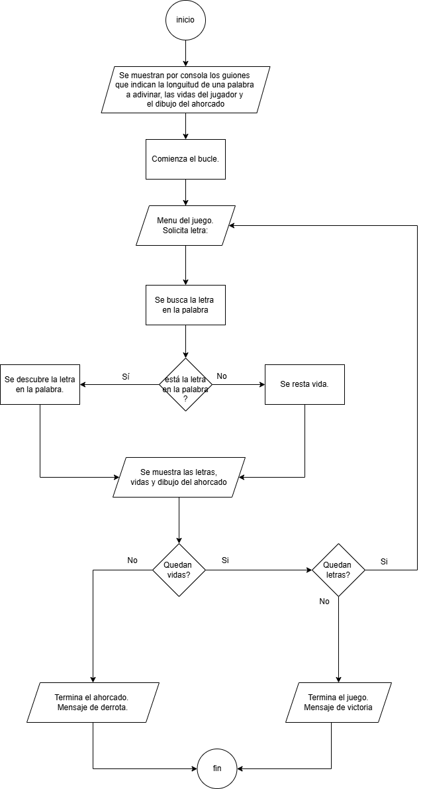

# Juego del Ahorcado y Piedra, Papel o Tijera

## 1. Introducción
Este proyecto incluye dos juegos desarrollados en JavaScript y un diagrama de flujo:

- Juego del Ahorcado y diagrama de flujo: El jugador adivina una palabra letra por letra antes de quedarse sin intentos.
- Piedra, Papel o Tijera: Un juego clásico optimizado con un código más eficiente y modular.

## 2. Juego del Ahorcado

### Descripción
El juego permite al jugador adivinar una palabra seleccionada al azar, letra por letra. Si se completa la palabra antes de agotar los intentos, el jugador gana. Si no, pierde.

### Instrucciones de uso
Abre el archivo `ahorcado.html` en tu navegador.
Presiona la tecla F12 para abrir la consola.
Sigue las indicaciones en pantalla para jugar.
Introduce letras para tratar de adivinar la palabra.
Observa los resultados de la consola y continua jugando.

### Diagrama de flujo

## 3. Piedra, Papel o Tijera

### Descripción
En este juego, el jugador compite contra la computadora seleccionando Piedra, Papel o Tijera. La lógica del programa determina al ganador con base en las reglas clásicas.

### Mejoras implementadas

A continuación una lista con las modificaciones más importantes:
- Legibilidad: renombrado de variables, comentarios y funciones con nombres y enunciados más claros.
- Resolución de conflictos en el código.

   
Abre el archivo `juego.html` en tu navegador.
Selecciona tu opción (Piedra, Papel o Tijera).
Revisa el resultado en pantalla.

## 4. Histórico de Commits

1. Se creó la estructura básica del proyecto diagrama de flujo del juego del ahorcado.

2. Se implementó la lógica del juego del ahorcado en el html.

3. Se creó la `rama test` donde se realizaron cambios en el archivo del diagrama de flujo.

4. En la rama test se introdujo el juego de piedra-papel-tijeras donde se modificaron el nombre de las variables y se ajustó la dinámica del juego elimando bugs.

5. Se creó el archivo README.md con la estructura básica.

6. Se realizó un merge de la `rama test` y la `rama main`.

7. Creacion de 2 carpetas para contener los archivos de cada juego.

## 5. Tecnologías utilizadas
HTML5: Para la estructura de la página.
Drawio: Para el diseño del diagrama de flujo.
JavaScript: Para la lógica de los juegos.

## 6. Autor
Nombre: Victoria Segovia
Correo: victoriasegovia001.alu@stemgranada.com
